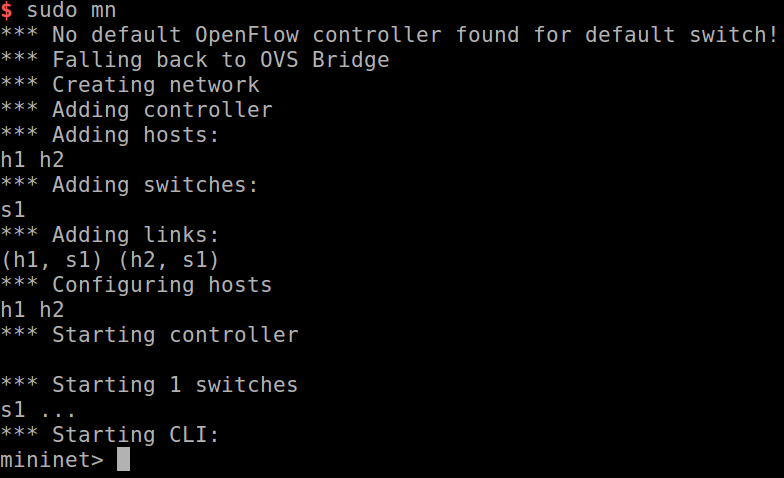
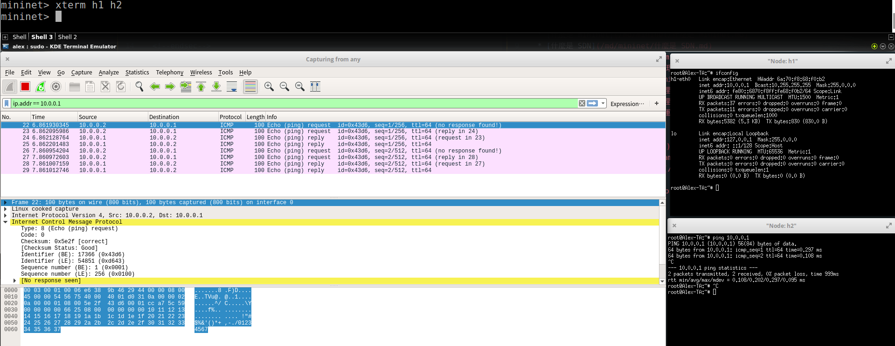
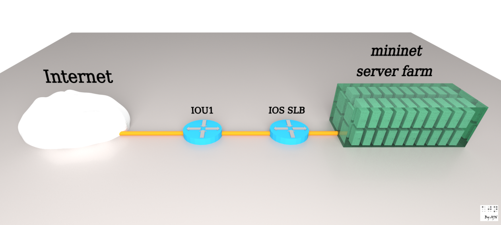
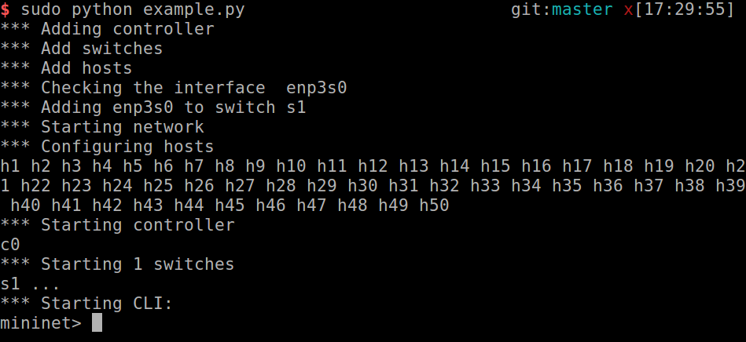

# mininet 實戰

tags: mininet

<!--sec data-title="安裝" data-id="1" data-nopdf="true" data-collapse=false ces-->

- **Debian Package**
  - `sudo apt-get install mininet`

- **Build source** and **install**
  ``` bash
  git clone git://github.com/mininet/mininet
  mininet/util/install.sh -a
  ```

<!--endsec-->

<!--sec data-title="啟動" data-id="2" data-nopdf="true" data-collapse=false ces-->

- 在沒有任何參數下，產生的虛擬環境為兩個`host (h1,h2)`，一個`switch (s1)`，並將h1,h2連接s1


- 啟動`sudo mn`



- **mininet**是基於**OVS**的應用軟體，當沒有設定`OVS Controller`時，他會退回**OVS Bridge模式**(不依賴Controller，預設所有node都是可以連通的)
  > **OVS**:全名`Open vSwitch`，類似**VM**，主要是**虛擬switch**，支援**OpenFlow**

<!--endsec-->

<!--sec data-title="測試" data-id="3" data-nopdf="true" data-collapse=false ces-->

- 顯示所有節點`nodes`


- 顯示所有節點的連接關係`net`


- 察看所有節點的資訊:`dump`


- 用**h1 ping h2** 一個封包`h1 ping  -c 1 h2`


- 叫出兩個host的命令視窗`xterm h1 h2`



<!--endsec-->

<!--sec data-title="Mininet Python API" data-id="4" data-nopdf="true" data-collapse=false ces-->

`Topo`: **Mininet**拓撲結構的**base class**

`build()`: The method to override in your topology class. Constructor parameters (n) will be passed through to it automatically by Topo.__init__().

`addSwitch()`: 給拓撲結構中增加一個**switch**，返回switch名字

`addHost()`: 增加**host**，返回host名字

`addLink()`: 增加一個**雙向link**，返回link的key

`Mininet`: 建立和管理網路的**main class**

`start()`: 開啟網路

`pingAll()`: 通過host之間的互**ping**測試連通性

`stop()`: 關閉網絡

`net.hosts`: 網路中的所有主機

`dumpNodeConnections()`: 所有的連接關係

`setLogLevel( 'info' | 'debug' | 'output' )`: set Mininet's default output level; 'info' is recommended as it provides useful information.

<!--endsec-->

<!--sec data-title="寫一個Python範例" data-id="6" data-nopdf="true" data-collapse=false ces-->

### 目標

- 啟動50個`hosts`，作為**VM server farm**
- 啟動1個`controller`
- 啟動1個`switch`



### Code

[import,template:"acefull",title:"example",theme:"monokai"](example.py)

### 執行

- `sudo python example.py`



### Q&A


執行出現**Cannot find required executable ovs-controller**




- 你沒有安裝**ovs-controller**
  - `sudo apt-get install openvswitch-testcontroller`
- **ovs-controller是舊名稱**，所以你需要複製一下
  - `sudo cp /usr/bin/ovs-testcontroller /usr/bin/ovs-controller`




執行出現

```
Exception: Please shut down the controller which is running on port 6653:
Active Internet connections (servers and established)
tcp        0      0 0.0.0.0:6653            0.0.0.0:*               LISTEN      30215/ovs-testcontr
```





- 你需要**kill**正在背景執行的**ovs-testcontroller**
  1. `sudo netstat -lptu`
  2. `sudo service ovs-testcontroller stop`



<!--endsec-->

<!--sec data-title="Mininet建立網路的三種方式" data-id="7" data-nopdf="true" data-collapse=false ces-->

### 底層API
- `Node` & `Link`

``` python
h1 = Host( 'h1' )
h2 = Host( 'h2' )
s1 = OVSSwitch( 's1', inNamespace=False )
c0 = Controller( 'c0', inNamespace=False )
Link( h1, s1 )
Link( h2, s1 )
h1.setIP( '10.1/8' )
h2.setIP( '10.2/8' )
c0.start()
s1.start( [ c0 ] )
print h1.cmd( 'ping -c1', h2.IP() )
s1.stop()
c0.stop()
```

### 中層API

- `net` Object

``` python
net = Mininet()
h1 = net.addHost( 'h1' )
h2 = net.addHost( 'h2' )
s1 = net.addSwitch( 's1' )
c0 = net.addController( 'c0' )
net.addLink( h1, s1 )
net.addLink( h2, s1 )
net.start()
print h1.cmd( 'ping -c1', h2.IP() )
CLI( net )
net.stop()
```

### 上層API

- `Topology` Object

``` python
class SingleSwitchTopo( Topo ):
    "Single Switch Topology"
    def __init__( self, count=1, **params ):
        Topo.__init__( self, **params )
        hosts = [ self.addHost( 'h%d' % i ) for i in range( 1, count + 1 ) ]
        s1 = self.addSwitch( 's1' )
        for h in hosts:
            self.addLink( h, s1 )                                                                          
                
net = Mininet( topo=SingleSwitchTopo( 3 ) )
net.start()
CLI( net )
net.stop()
```

<!--endsec-->
