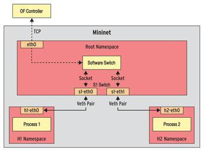

# 範例

<!--sec data-title="此範例的目標是？" data-id="1" data-nopdf="true" data-collapse=false ces-->
通過`ip`這個command創建`H1`和`H2`兩個`Network namespace`
1. `H1`擁有自己的Network namespace以及私有網路網路接口`h1-eth0`
2. `H2`擁有自己的Network namespace以及私有網路網路接口`h2-eth0`
3. 軟體Switch `S1`有兩個埠`s1-eth0`和`s1-eth1`
4. 通過`veth pair`與對應的主機接口相連，這樣H1和H2就可以通過S1進行通信
5. `s1-eth0`和`s1-eth1`間的通訊資料通過軟體Switch轉發   
它運行在`root namespace`,並使用實體接口eth0，等待控制器的指令



<!--endsec-->

<!--sec data-title="什麼是ip command?" data-id="2" data-nopdf="true" data-collapse=false ces-->
- `ip`這個command是`iproute2`軟體包裡面的一個強大的網路配置工具   
- 它能夠替代一些傳統的網路管理工具，例如:`ifconfig`、`route`
- 使用權限要為`root`
- 幾乎所有的Linux發行版本都支持該command
<!--endsec-->

<!--sec data-title="介紹ip command吧" data-id="11" data-nopdf="true" data-collapse=false ces-->
- `ip netns add <NetNS 名稱>` - 新增NetNS
- `ip netns list` - 列出現有的NetNS
- `ip netns identify <PID>` - 顯示PID所在的NetNS
- `ip netns identify $$` - 顯示目前的NetNS
- `ip netns exec <NetNS 名稱> <command>` - 在NetNS執行command
- `ip link add <veth 名稱> type veth peer name <veth 另一端的名稱>` - 建立一個veth裝置
- `ip link set <veth 名稱> nets <NetNS 名稱>` - 將veth 搬到NetNS
<!--endsec-->

<!--sec data-title="Step 1 - Create host namespaces" data-id="3" data-nopdf="true" data-collapse=false ces-->
``` shell
$ sudo ip netns add h1
$ sudo ip netns add h2
$ sudo ip netns
```


<!--endsec-->

<!--sec data-title="Step 2 - Create switch" data-id="4" data-nopdf="true" data-collapse=false ces-->
``` shell   
$ sudo ovs-vsctl add-br s1
```


<!--endsec-->

<!--sec data-title="Step 3 - Create links" data-id="5" data-nopdf="true" data-collapse=false ces-->
``` shell   
$ sudo ip link add h1-eth0 type veth peer name s1-eth1
$ sudo ip link add h2-eth0 type veth peer name s1-eth2
$ sudo ip link show
```


<!--endsec-->

<!--sec data-title="Step 4 - Move host ports into namespaces" data-id="6" data-nopdf="true" data-collapse=false ces-->
``` shell   
$ sudo ip link set h1-eth0 netns h1
$ sudo ip link set h2-eth0 netns h2
$ sudo ip netns exec h1 ip link show
$ sudo ip netns exec h2 ip link show
```


<!--endsec-->

<!--sec data-title="Step 5 - Connect switch ports to OVS" data-id="7" data-nopdf="true" data-collapse=false ces-->
``` shell   
$ sudo ovs-vsctl add-port s1 s1-eth1
$ sudo ovs-vsctl add-port s1 s1-eth2
$ sudo ovs-vsctl show
```


<!--endsec-->

<!--sec data-title="Step 6 - Set up OpenFlow controller" data-id="8" data-nopdf="true" data-collapse=false ces-->
``` shell   
$ sudo ovs-vsctl set-controller s1 tcp:127.0.0.1
$ sudo ovs-controller ptcp:
$ sudo ovs-vsctl show
```


<!--endsec-->

<!--sec data-title="Step 7 - Configure network" data-id="9" data-nopdf="true" data-collapse=false ces-->
``` shell   
$ sudo ip netns exec h1 ifconfig h1-eth0 10.1
$ sudo ip netns exec h1 ifconfig lo up
$ sudo ip netns exec h2 ifconfig h2-eth0 10.2
$ sudo ip netns exec h2 ifconfig lo up
$ sudo ifconfig s1-eth1 up   
$ sudo ifconfig s1-eth2 up
```
<!--endsec-->

<!--sec data-title="Step 8 - Test network" data-id="10" data-nopdf="true" data-collapse=false ces-->
``` shell   
$ sudo ip netns exec h1 ping -c1 10.2
```


<!--endsec-->


