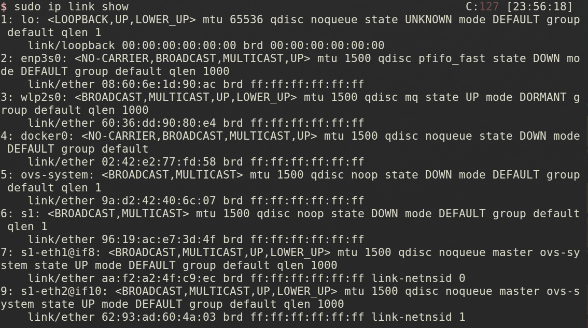
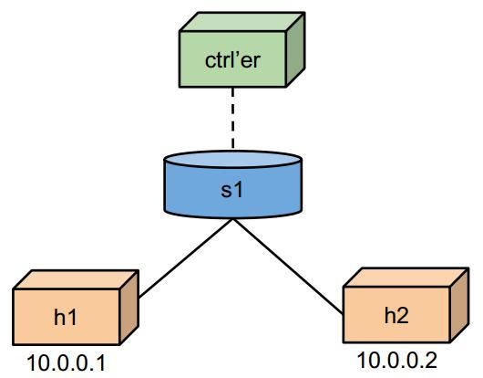

# 範例

tags: Namespace, Network namespace

<!--sec data-title="此範例的目標是？" data-id="1" data-nopdf="true" data-collapse=false ces-->

- 使用`ip`創建`H1`和`H2`兩個`Network namespace`
  - `H1`擁有自己的Network namespace以及私有網路網路接口`h1-eth0`
  - `H2`擁有自己的Network namespace以及私有網路網路接口`h2-eth0`

- 使用`ovs-vsctl`創建Software Switch`S1`
  - `S1`有兩個埠`s1-eth0`和`s1-eth1`
  - `S1`運行在`root namespace`,並使用實體接口`eth0`，等待Controller的指令
  - 使用`veth pair`與對應的Host接口相連，這樣`H1`和`H2`就可以透過`S1`溝通
  - `s1-eth0`和`s1-eth1`間的通訊資料透過Software Switch轉發

<!--endsec-->

<!--sec data-title="什麼是ip command?" data-id="2" data-nopdf="true" data-collapse=false ces-->

- `ip`這個command是`iproute2`軟體包裡面的一個強大的網路配置工具   
  - 它能夠替代一些傳統的網路管理工具，例如:`ifconfig`、`route`
  - 使用權限要為`root`
  - 幾乎所有的Linux發行版本都支持該command

<!--endsec-->

<!--sec data-title="介紹ip command吧" data-id="11" data-nopdf="true" data-collapse=false ces-->

- `ip netns add <NetNS 名稱>` - 新增NetNS
- `ip netns list` - 列出現有的NetNS
- `ip netns identify <PID>` - 顯示PID所在的NetNS
- `ip netns identify $$` - 顯示目前的NetNS
- `ip netns exec <NetNS 名稱> <command>` - 在Network namespace執行command
- `ip link add <veth 名稱> type veth peer name <veth 另一端的名稱>` - 建立一個veth裝置
- `ip link set <veth 名稱> nets <NetNS 名稱>` - 將veth 搬到NetNS

<!--endsec-->

<!--sec data-title="Step 1 - Create host namespaces" data-id="3" data-nopdf="true" data-collapse=false ces-->

1. 建立`H1 namespaces`
  - `sudo ip netns add h1`
2. 建立`H2 namespaces`
  - `sudo ip netns add h2`
3. 察看建立結果
  - `sudo ip netns`

<!--endsec-->

<!--sec data-title="Step 2 - Create switch" data-id="4" data-nopdf="true" data-collapse=false ces-->

1. 建立`Switch`
  - `sudo ovs-vsctl add-br s1`

<!--endsec-->

<!--sec data-title="Step 3 - Create links" data-id="5" data-nopdf="true" data-collapse=false ces-->

1. 建立`Link 1` (h1-eth0 - s1-eth1)
  - `sudo ip link add h1-eth0 type veth peer name s1-eth1`
2. 建立`Link 2` (h2-eth0 - s1-eth2)
  - `sudo ip link add h2-eth0 type veth peer name s1-eth2`
3. 顯示連結結果
  - `sudo ip link show`

<!--endsec-->

<!--sec data-title="Step 4 - Move host ports into namespaces" data-id="6" data-nopdf="true" data-collapse=false ces-->

1. 將`H1 port`移到`H1 namespaces`
  - `sudo ip link set h1-eth0 netns h1`
2. 將`H2 port`接到`H2 namespaces`
  - `sudo ip link set h2-eth0 netns h2`
3. 顯示`H1 namespaces`的連結
  - `sudo ip netns exec h1 ip link show`
4. 顯示`H2 namespaces`的連結
  - `sudo ip netns exec h2 ip link show`

<!--endsec-->

<!--sec data-title="Step 5 - Connect switch ports to OVS" data-id="7" data-nopdf="true" data-collapse=false ces-->

1. 將`S1 port1`連接到`Switch`
  - `sudo ovs-vsctl add-port s1 s1-eth1`
2. 將`S1 port2`連接到`Switch`
  - `sudo ovs-vsctl add-port s1 s1-eth2`
3. 顯示`Switch`的連結
  - `sudo ovs-vsctl show`

<!--endsec-->

<!--sec data-title="Step 6 - Set up OpenFlow controller" data-id="8" data-nopdf="true" data-collapse=false ces-->

1. 設定`Controller`
  - `sudo ovs-vsctl set-controller s1 tcp:127.0.0.1`
2.  Controller監聽端口上的`OpenFlow TCP`連接（默認值:6633)
  - `sudo ovs-controller ptcp:`
3. 查詢`OpenFlow Controller`是否正確連接到`S1`
  - `sudo ovs-vsctl show`

<!--endsec-->

<!--sec data-title="Step 7 - Configure network" data-id="9" data-nopdf="true" data-collapse=false ces-->

1. 修改`H1 port`網路介面，給予`H1 eth0`一個 `10.0.0.1` 的參數
  - `sudo ip netns exec h1 ifconfig h1-eth0 10.1`
2. 啟動`H1 eth0`網路介面
  - `sudo ip netns exec h1 ifconfig lo up`
3. 修改`H2 port`網路介面，給予`H2 eth0`一個 `10.0.0.2` 的參數
  - `sudo ip netns exec h2 ifconfig h2-eth0 10.2`
4. 啟動`H2 eth0`網路介面
  - `sudo ip netns exec h2 ifconfig lo up`
5. 啟動`Switch`網路介面
  - `sudo ifconfig s1-eth1 up`
  - `sudo ifconfig s1-eth2 up`

<!--endsec-->

<!--sec data-title="Step 8 - Test network" data-id="10" data-nopdf="true" data-collapse=false ces-->

1. 透過`H1`網路介面`Ping H2`網路介面`
  - `sudo ip netns exec h1 ping -c1 10.2`

<!--endsec-->

