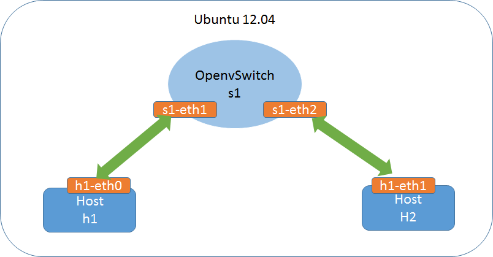

# mininet 實戰

<!--sec data-title="安裝" data-id="1" data-nopdf="true" data-collapse=false ces-->

- Debian Package
  - `sudo apt-get install mininet`

- Build source and install
  ``` bash
  git clone git://github.com/mininet/mininet
  mininet/util/install.sh -a
  ```

<!--endsec-->

<!--sec data-title="啟動" data-id="2" data-nopdf="true" data-collapse=false ces-->

`sudo mn`


- mininet是基於OVS的應用軟體，當沒有設定`OVS Controller`時，他會退回OVS Bridge模式(不依賴Controller，預設所有node都是可以連通的)

> `OVS`:全名`Open vSwitch`，類似VM，主要是`虛擬switch`，支援OpenFlow

- 在沒有任何參數下，產生的虛擬環境為兩個`host (h1,h2)`，一個`switch (s1)`，並將h1,h2連接s1




<!--endsec-->

<!--sec data-title="測試" data-id="3" data-nopdf="true" data-collapse=false ces-->

顯示所有節點:`nodes`


顯示所有節點的連接關係:`net`


察看所有節點的資訊:`dump`


用h1 ping h2 一個封包:`h1 ping  -c 1 h2`


叫出兩個host的命令視窗:`xterm h1 h2`


<!--endsec-->


<!--sec data-title="寫一個Python範例" data-id="4" data-nopdf="true" data-collapse=false ces-->

### 目標
- 啟動50個`hosts`，作為VM server farm
- 啟動1個`controller`
- 啟動1個`switch`


### Code
[import,template:"acefull",title:"example",theme:"monokai"](example.py)

### 執行
`sudo python example.py`


### 問題

執行出現`Cannot find required executable ovs-controller`



你沒有安裝`ovs-controller`   
`sudo apt-get install openvswitch-testcontroller`    
而`ovs-controller`是舊名稱，所以你需要複製一下   
`sudo cp /usr/bin/ovs-testcontroller /usr/bin/ovs-controller`



執行出現
```
Exception: Please shut down the controller which is running on port 6653:
Active Internet connections (servers and established)
tcp        0      0 0.0.0.0:6653            0.0.0.0:*               LISTEN      30215/ovs-testcontr
```



你需要kill正在背景執行的ovs-testcontroller     
`sudo netstat -lptu`    
`sudo service ovs-testcontroller stop`

<!--endsec-->

<!--sec data-title="Mininet Python API" data-id="5" data-nopdf="true" data-collapse=false ces-->

`Topo`: the base class for Mininet topologies

`build()`: The method to override in your topology class. Constructor parameters (n) will be passed through to it automatically by Topo.__init__().

`addSwitch()`: adds a switch to a topology and returns the switch name

`addHost()`: adds a host to a topology and returns the host name

`addLink()`: adds a bidirectional link to a topology (and returns a link key, but this is not important). Links in Mininet are bidirectional unless noted otherwise.

`Mininet`: main class to create and manage a network

`start()`: starts your network

`pingAll()`: tests connectivity by trying to have all nodes ping each other

`stop()`: stops your network

`net.hosts`: all the hosts in a network

`dumpNodeConnections()`: dumps connections to/from a set of nodes.

`setLogLevel( 'info' | 'debug' | 'output' )`: set Mininet's default output level; 'info' is recommended as it provides useful information.

<!--endsec-->
