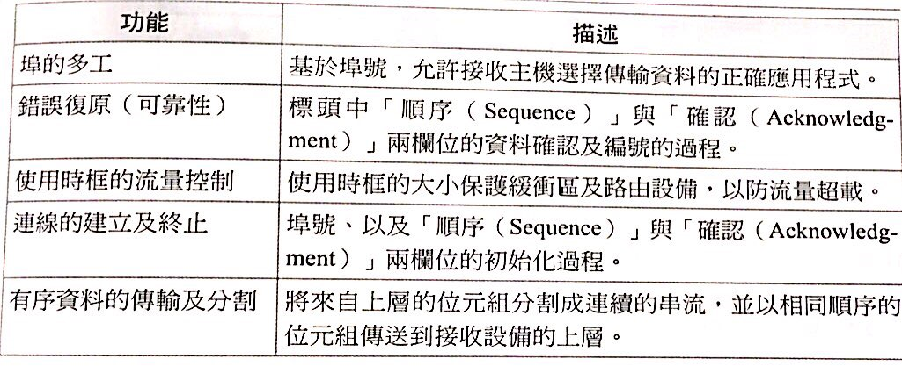
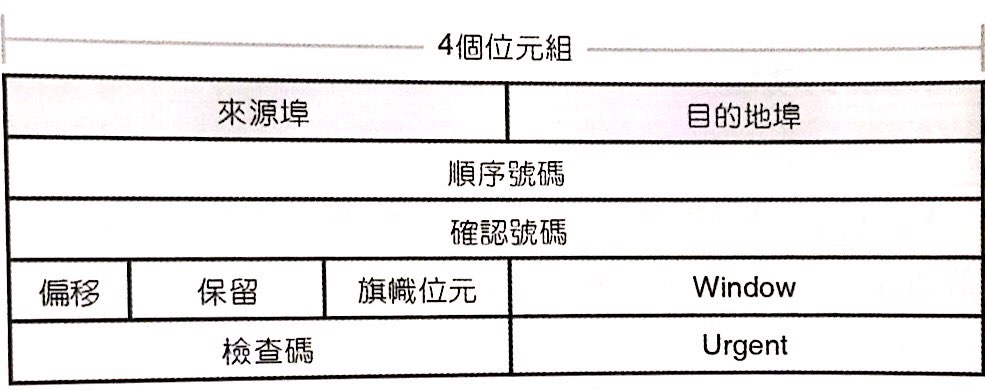
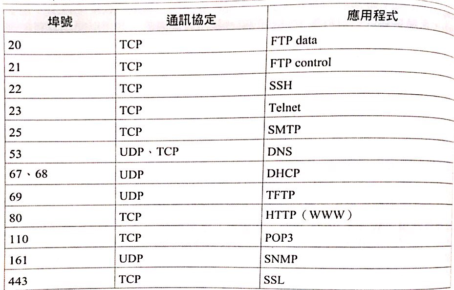
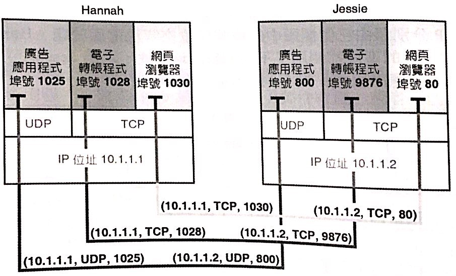

# TCP/IP傳輸層和應用層的基本原理

tags: CCNA,Network,Cisco,通訊,Protocol,證照

## 名詞定義

|   中文   | 英文簡稱 | 英文全稱|
| :--------: | :--------:| :------: |
|網路電話|VoIP|Voice over IP|
|網路視訊||Video over IP|
|全球資訊網|WWW|World Wide Web|
|專門管理網路設備的軟體使用|DNS|Domain Name System|
|小型檔案傳輸協定|TFTP|Trivial File Transfer Protocol|
|檔案傳輸協定|FTP|File Transfer Protocol|
|簡單郵件傳輸通訊協定|SMTP|Simple Mail Transfer Protocol|
|郵件通訊協定版本|POP3|Post Office Protocol version 3|
|動態埠號||dynamic port numbers|
|網路檔案系統|NFS|Network File System|
|唯一資源定位器|URL|Unifrom Resource Locator|

<!--sec data-title="傳輸層目標與功能要求" data-id="1" data-nopdf="true" data-collapse=false ces-->

- **UDP**只支援下表的第一項，**TCP**則支援全部。

- **提供服務**給應用程式。
- **TCP**標頭如下。

- **UDP**的標頭如下。

- 為了區別封包要餵給哪個應用程式，所以**TCP/UDP**都用了**埠號**。

- 多工使用了**通訊端(Socket)**的概念。

> **Socket**包含三個方面：
> - **IP 位置**
> - **傳輸通訊協定**
> - **埠號**

- 埠號**1024**以下，是保留給公認應用程式使用。
- 埠號**1024**開始，稱為**動態埠號(dynamic port numbers)**。
- 一般公認的埠號都使用在**伺服器**上，其他埠號則使用在用戶端上。

>  常見的**TCP/IP**應用程式有：
>- **WWW**：網頁伺服器。
>- **DNS**：查詢名稱對應的IP。
>- **SNMP**：專門管理網路設備的軟體使用。
>- **TFTP**：小型檔案傳輸協定。
>- **FTP**：檔案傳輸協定。
>- **SMTP**：簡單郵件傳輸通訊協定。
>- **POP3**：郵件通訊協定版本。

>常見的UDP應用程式有：
>- **網路電話(VoIP*)**& **網路視訊**。
>- **DNS的請求**。
>- **網路檔案系統(NFS)**：使用**應用層的復原**。

- **三向交握**使用了**SYN** flag & **ACK** flag & **FIN** flag。
- 大體來說，傳輸層通訊協定分為**連接導向 **& **非連接導向**兩大類，用以表明是否**交換資料前**是否要先建立關係。

<!--endsec-->

<!--sec data-title="TCP/IP應用層" data-id="2" data-nopdf="true" data-collapse=false ces-->

- 應用程式大略分三類型的**服務品質(QoS)**需求：**批次處理**、**互動式**、**即時性**。

>**QoS**包含四個特徵
>- **頻寬**：每秒傳輸的位元量。
>- **延遲**：IP傳輸所需時間。
>- **抖動**：延遲產生的變動量。
>- **耗損**：到達前被丟棄的百分比。

- 批次處理比較在意**頻寬**。

<!--endsec-->