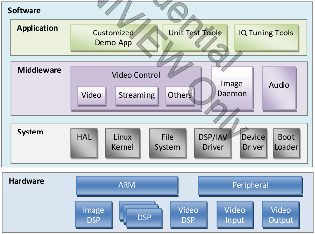

<!-- slide -->
# Ambarella S2L - Code Building and Debug


<!-- slide -->
# Software Architecture




<!-- slide -->
# Source Code - Directory
- amboot/ - `Boot loader`,`HAL image`,`tool`
- app/ - `Demo` applications
- boards/ - compile configuration
- build/ - `make file`,`AmbaConfig` rules
- include/
- kernel/
- - linux/ - `Linux kernel`
- - private/ - `Amba drivers`
- license/
- out/ - `Build target`

<!-- slide -->
# Source Code - Directory
- packages/
- - bsreader/ - `bit stream FIFO reader`
- - data_transfer/ - USB/TCP資料傳輸 code
- - img_algo/ - 沒有Code,只有libs在`prebuild/imgproc`
- - img_mw/ - `IP` processing Middleware codes
- - low_bitrate/ - `Low Bit Rate` codes
- - md_motbuf/ - `motion detection` codes
- - textinsert/ - 文字轉圖片的libs
- - utils/ - `util` codes
> log,version,config

- prebuild/ - `Amba libs` & `第3方 libs`
- rootfs/
- unit_test/ - `Unit test` tools

<!-- slide -->
# Install package
``` bash
$sudo apt-get install git-core gnupg flex bison gperf build-essential zip curl zlib1g-dev wget mtd-utils fakeroot cramfsprogs genext2fs gawk subversion git-gui gitk unixodbc texinfo gcc-multilib g++-multilib
```

<!-- slide -->
# Toolchain
### Install Toolchain
- Install the Toolchain
``` bash
$ cd tools/ToolChain
$ sudo chmod +x ubuntuToolChain
$ sudo ./ubuntuToolChain
```
- Test Toolchain
``` bash
$ export PATH=$PATH:/usr/local/linaro-multilib-2014.06-gcc4.9/bin/
$ arm-linux-guneabihf-gcc hello.c -o hello.c
```

<!-- slide -->
# Build Firmware
``` bash
$source ambarella/build/env/Linaro-multilib-gcc4.8.env
$cd ambarella/boards/hawthorn
$make sync_build_mkcfg
$make s2l_ipcam_config
$make -j8
```
output
`ambarella/out/hawthorn/images/amboot_bld_hal_secondary_lnx_release.bin`

<!-- slide -->
# Build Firmware

> ===============================================
ELF TOOLCHAIN PATH: /usr/local/arm-elf
ELF TOOLCHAIN NAME: arm-elf-
ELF TOOLCHAIN VERSION: 4.5.2
TOOLCHAIN PATH: /usr/local/linaro-multilib-2014.06-gcc4.9
TOOLCHAIN NANE: arm-linux-gnueabihf
TOOLCHAIN VERSION: 4.9.1
===============================================

<!-- slide -->
# Build SDK
``` bash
$make clean - Delete out directory
$make distclean - Delete all temporary objects in compilation
$make menuconfig - Display the kernel menuconfig
$make defconfig_public_linux - Default kernel config
$make show_configs - Show all configuration files
$make test_encode - Compile the program test_encode
$make test_image
$make rtsp_server
$make libamp.so
$make linux
$make prepare_private_drivers
$make build_private_drivers
$make clean_private_drivers
```

<!-- slide -->
# Kernel log
Kernel Log
- Path - ``/var/log/message` (200 KB)
> 修改:
>``` bash
>s2l $ syslogd –O <filename> -s <filesize in KB>
>s2l $ klogd
>```
>EX:
>``` bash
>s2l $ syslogd –O /tmp/kernel_log.txt -s 1000
>s2l $ klogd
>```
- logread - see kernel log

<!-- slide -->
# DSP log
- use `dsplog_cap` to encoding binary log
> 存到SD卡：
> ``` bash
> s2l $ dsplog_cap -m all -l 3 -r 0 –o /sdcard/log1.bin
> ```
> 存到SD卡,且容量上限100MB：
> ``` bash
> s2l $ dsplog_cap -m all -l 3 -r 0 –o /sdcard/log1.bin -p 100000000
> ```

<!-- slide -->
# Amba driver log
- `/proc/amkmsg` - 不是`/proc/kmsg`
- 預設是關的
> ``` bash
> $ make menuconfig
> ```
> [ * ] Ambarella Linux Configuration --->
> [ * ] Ambarella Private Linux Configuration --->
> [ * ] Build Ambarella private drv msg module
